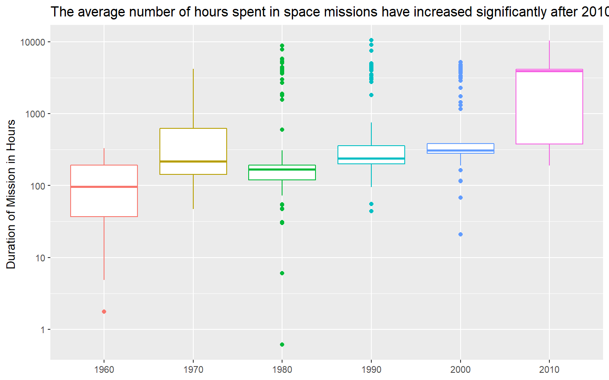
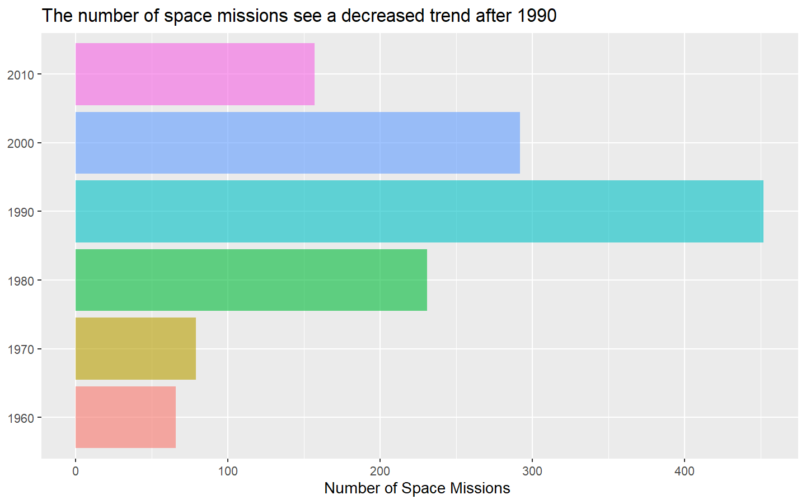

Predicting Astronauts Mission Duration using Tidymodels in R
================
Gaurav Sharma
17/07/2020

### Load the data

``` r
ttload <- tidytuesdayR::tt_load(x = "2020-07-14")
```

    ## --- Compiling #TidyTuesday Information for 2020-07-14 ----

    ## --- There is 1 file available ---

    ## --- Starting Download ---

    ## 
    ##  Downloading file 1 of 1: `astronauts.csv`

    ## --- Download complete ---

``` r
astranauts <- ttload$astronauts
```

### Some EDA

Chang-Diaz, Franklin R. and Ross, Jerry L. have done the most number of
missions in the history. Both have been to space 7 times. Both belong to
US. Following table sows top 10 astronauts with most number of trips

``` r
astranauts %>% 
    select(name, nationality, sex, hours_mission, total_hrs_sum) %>% 
    count(nationality, name, sex, sort = T) %>% 
    head(10) %>% 
    knitr::kable()
```

| nationality    | name                     | sex  | n |
| :------------- | :----------------------- | :--- | -: |
| U.S.           | Chang-Diaz, Franklin R.  | male | 7 |
| U.S.           | Ross, Jerry L.           | male | 7 |
| U.S.           | Brown, Curtis L., Jr.    | male | 6 |
| U.S.           | Foale, C. Michael        | male | 6 |
| U.S.           | Musgrave, Franklin Story | male | 6 |
| U.S.           | Wetherbee, James D.      | male | 6 |
| U.S.           | Young, John W.           | male | 6 |
| U.S.S.R/Russia | Krikalev, Sergei         | male | 6 |
| U.S.S.R/Russia | Malenchenko, Yuri        | male | 6 |
| U.S.           | Blaha, John E.           | male | 5 |

There are 40 countries that have been to space at least once. US tops
the lists with 854 missions, Russia has 273 mission so far. Following
table sows top 10 countries with most number of space missions.

``` r
astranauts %>% 
    select(nationality) %>% 
    count(nationality, sort = T) %>% 
    head(10) %>% 
    knitr::kable()
```

| nationality    |   n |
| :------------- | --: |
| U.S.           | 854 |
| U.S.S.R/Russia | 273 |
| Japan          |  20 |
| Canada         |  18 |
| France         |  18 |
| Germany        |  16 |
| China          |  14 |
| Italy          |  13 |
| U.K./U.S.      |   6 |
| Australia      |   4 |

Let’s plot a visualization to see how duration of space mission has
change over the decades.

``` r
astranauts %>% 
  mutate(year_of_mission = 10*(year_of_mission %/% 10)) %>% 
  mutate(year_of_mission = factor(year_of_mission)) %>% 
  select(year_of_mission, hours_mission) %>% 
  ggplot(aes(x = year_of_mission, y = hours_mission, color = year_of_mission)) +
  geom_boxplot(show.legend = F) +
  scale_y_log10() +
  ggtitle("The average number of hours spent in space missions have increased significantly after 2010",) +
  labs(x = NULL,
       y = "Duration of Mission in Hours ")
```

    ## Warning: Transformation introduced infinite values in continuous y-axis

    ## Warning: Removed 6 rows containing non-finite values (stat_boxplot).

<!-- --> Interestingly,
the duration of missions has increased over the decades and their is a
significant jump in median duration after 2010, which generates a
hypothesis here that year of mission can be a good predictor of duration
of space mission. We will confirm this hypothesis later, let’s move
further.

Similarly, We can plot a similar visualization for the number of space
mission in each decade. It will be interesting to see.

``` r
astranauts %>% 
  mutate(year_of_mission = 10*(year_of_mission %/% 10)) %>% 
  mutate(year_of_mission = factor(year_of_mission)) %>% 
  count(year_of_mission) %>% 
  ggplot(aes(x = year_of_mission, y = n, fill = year_of_mission)) +
  geom_col(show.legend = F, alpha = 0.6) +
  ggtitle("The number of space missions see a decreased trend after 1990",) +
  labs(x = NULL,
       y = "Number of Space Missions ") +
  coord_flip()
```

<!-- -->
